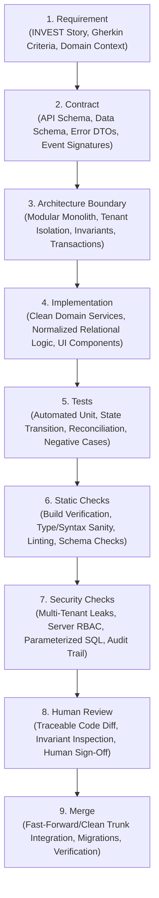

# ROCKEYE ERP + MES — Coding Standards & Disciplined Vibe Coding Pipeline

**Status:** Approved Standard  
**Target:** Engineering Team & AI Autonomous Agents  
**Scope:** Whole Repository (Backend, Frontend, Schema, APIs, Tests)  
**Date:** 2026-10-01  

---

## 1. Executive Summary & Philosophy

In commercial enterprise software—and specifically within mission-critical industrial applications like palm oil milling operations—speed of development with AI assistance ("vibe coding") must never compromise architectural integrity, multi-tenant security, data immutability, or operational safety.

Unstructured vibe coding (prompting straight to code without verification gates) creates fragile prototypes with unmaintainable dependencies, security vulnerabilities, and data corruption risks. 

**Disciplined Vibe Coding** establishes an uncompromising, sequential 9-stage engineering pipeline:

```
Requirement
   ↓
Contract
   ↓
Architecture boundary
   ↓
Implementation
   ↓
Tests
   ↓
Static checks
   ↓
Security checks
   ↓
Human review
   ↓
Merge
```

Every new capability, bug fix, or refactor executed by engineers or AI agents must progress through these nine stages in order. Skipping stages or reversing the sequence is strictly prohibited.

---

## 2. The 9-Stage Vibe Coding Pipeline



---

## 2. Repository Architecture & Folder Structure

The project layout enforces strict separation of concerns across three repository boundaries:

```
PUBLIC / MAIN REPOSITORY
├── apps/                       # Application runtimes & entrypoints (web SPA, API service)
├── modules/                    # Modular monolithic business domains (commercial, receiving, production, etc.)
├── packages/                   # Foundational shared libraries (shared formatters, errors, api-client)
├── core/contracts/             # Versioned API schemas, SQL DDL schemas, event contracts, error envelopes
├── tests/                      # Automated test suites (domain, integration, contracts, structure)
└── docs/public/                # Public technical specifications, coding standards, architecture guides


PRIVATE CORE REPOSITORIES
├── risk-engine/                # Proprietary supplier risk scoring & credit exposure algorithms
├── pricing-engine/             # Dynamic MPOB index-linked pricing & quality penalty matrix
├── policy-engine/              # Multi-tier approval routing & operational threshold evaluation
├── entitlement-engine/         # SaaS plan tiers, capacity quotas, and module feature gating
└── security-engine/            # Cryptographic audit hash chaining & tenant isolation guards


PRIVATE OPERATIONS REPOSITORY
├── infrastructure/             # Container orchestration (docker-compose.prod.yml) & cloud IaC
├── production/                 # Production environment manifests, systemd service units
├── security-policies/          # SOC 2 controls, data classification, and network isolation policies
├── runbooks/                   # Mill disaster recovery, offline weighbridge buffering, and failover
└── restricted-docs/            # Proprietary mass-balance models & internal threat modeling
```

---

## 3. The 9-Stage Vibe Coding Pipeline in Detail

### Stage 1: Requirement

**Objective:** Transform user requests and business needs into unambiguous, grounded domain requirements before writing any code.

* **Domain Grounding:** Anchor every requirement in the operational reality of palm oil milling (FFB receiving, weighbridge capture, grading, sterilizing, threshing, pressing, clarification, kernel recovery, storage tanks, dispatch, and commercial contracts).
* **Hierarchy Scoping:** Explicitly define the organization level:
  `Tenant / Group → Legal Company → Operating Company → Mill / Site → Production Line → Station → Machine / Storage Unit`.
* **INVEST Specifications:** Formulate requirements as INVEST-compliant user stories (Independent, Negotiable, Valuable, Estimable, Small, Testable).
* **Gherkin Acceptance Criteria:** Define explicit `Given-When-Then` scenarios covering happy paths, edge cases, failure modes, and recovery procedures.
* **Exit Gate:** A clear specification defining inputs, business rules, expected side effects, and acceptance criteria.

---

### Stage 2: Contract

**Objective:** Establish explicit, typed, and versioned contracts between systems, modules, and tiers before writing implementation code.

* **API Contracts:**
  * Standard RESTful naming: `/api/v1/<domain-resource>`.
  * Explicit HTTP methods: `GET` for safe tenant-scoped queries, `POST` for business commands and state transitions (e.g. `/api/v1/ffb-receipts/:id/confirm`).
  * Explicit request and response schemas (fields, types, required flags, defaults).
  * Standardized response envelope:
    ```json
    {
      "success": true,
      "data": { ... },
      "meta": { "page": 1, "pageSize": 50, "total": 120 }
    }
    ```
  * Idempotency contract: Command endpoints accepting state transitions must accept and enforce an `Idempotency-Key` header.
* **Data Contracts (Persistence):**
  * Normalized relational schema definitions (DDL / migrations).
  * Foreign key relationships, non-nullable constraints, check constraints, and unique compound indexes (e.g., `UNIQUE(tenant_id, code)`).
  * Mandatory audit columns: `created_at`, `created_by`, `updated_at`, `updated_by`.
* **Error Contracts:**
  * Predictable, machine-readable error codes and human-intelligible messages:
    ```json
    {
      "success": false,
      "error": {
        "code": "CONTRACT_BALANCE_EXCEEDED",
        "message": "Requested delivery quantity (45.00 MT) exceeds remaining contract balance (30.00 MT).",
        "details": { "contractId": "PC-2026-001", "available": 30.0, "requested": 45.0 }
      }
    }
    ```
* **Event & Interface Contracts:**
  * Defined event schemas for outbox/domain events (`event_name`, `entity_type`, `entity_id`, `tenant_id`, `mill_id`, `payload`, `timestamp`).
* **Exit Gate:** Verified schemas, endpoint definitions, and data types approved without ambiguity.

---

### Stage 3: Architecture Boundary

**Objective:** Guard domain boundaries, dependency directions, tenant isolation, and transactional invariants before writing code.

* **Modular Monolith Dependencies:**
  * `Platform` and `Master Data` are foundational: they never depend on operational modules.
  * Operational modules (`Commercial`, `Weighbridge`, `Receiving`, `Production`, `Quality`, `Inventory`, `Dispatch`) interact via explicit application interfaces or domain events; they never execute direct SQL writes on another module's tables.
  * `Inventory` is the sole owner of material balances and movement ledgers.
  * `Reporting` queries read models and projections; it never mutates transactional state.
* **Tenant & Operating Scoping:**
  * Every transactional table must include `tenant_id`, and operational records must include `mill_id`.
  * Session context derives authority; client-supplied tenant IDs must never be trusted without verification.
* **Transactional Boundaries:**
  * Critical business commands execute inside an atomic database transaction (e.g., FFB receipt confirmation must atomically lock weighbridge record, validate grading, allocate contract quantity, generate lot, post inventory movements, and write audit event).
* **Controlled Correction & Immutability:**
  * Operational postings (material receipts, movements, dispatches, quality results) are immutable traceable records.
  * Adjustments must occur via controlled reversals or compensating transactions—never through silent UPDATEs or DELETEs of historical records.
* **Exit Gate:** Architectural review confirms zero dependency violations, correct transaction scopes, and complete tenant boundaries.

---

### Stage 4: Implementation

**Objective:** Implement domain logic, application services, APIs, and UI components strictly conforming to the contract and architecture boundaries.

* **Backend Standards:**
  * Clean, idiomatic JavaScript / TypeScript (Node.js ESM).
  * Domain services encapsulate business rules; route controllers only handle HTTP deserialization, validation, service invocation, and response serialization.
  * No hardcoded business assumptions (capacities, extraction rates, quality limits, document numbering formats). These must be retrieved from tenant/mill configuration or versioned master data.
  * Parameterized SQL queries using trusted drivers (`better-sqlite3`, `pg`). Never concatenate strings into SQL queries.
* **Frontend Standards:**
  * Modular React 19 functional components with explicit props and hooks.
  * Enterprise UI design language: high-density, accessible, responsive tables, clear status tags, keyboard-navigable dialogs, and slide-over detail drawers.
  * Client-side validation for instant user feedback, paired with the awareness that server-side validation is the true authoritative boundary.
  * Error presentation using normalized error helpers and semantic tones (error, warning, success, info).
* **Exit Gate:** Implementation complete, formatted, readable, and free of extraneous debug logs.

---

### Stage 5: Tests

**Objective:** Prove correctness, safety, and business invariant compliance through automated tests.

* **Testing Pyramid:**
  * **Domain Unit Tests:** Pure business calculations (gross/tare/net weighbridge calculations, contract utilization, grading reconciliation, state machine transitions).
  * **Application Service Tests:** Permission guards, idempotency enforcement, state transition validation, atomic transaction handling.
  * **Integration & API Tests:** Route handler contracts, parameter validation, HTTP status codes, error payload schemas.
* **Negative & Edge-Case Testing:**
  * Mandatory tests for edge cases: concurrent over-utilization, invalid transitions (e.g. attempting to cancel an already-posted receipt), mismatched net weights, negative quantities, missing required fields.
* **Execution Rule:**
  * All tests run via standard runner:
    ```bash
    npm test
    ```
  * **Zero Failure Policy:** 100% test pass rate required. No skipped or failing tests permitted in the mainline.
* **Exit Gate:** `npm test` runs cleanly and reports zero failures.

---

### Stage 6: Static Checks

**Objective:** Validate code syntax, module resolution, build integrity, and static type safety before code is considered for review.

* **Build Verification:**
  * The production client bundle must compile without errors:
    ```bash
    npm run build
    ```
  * Zero Vite build errors, unresolved chunk errors, or missing asset warnings.
* **Syntax & Static Sanity:**
  * Verify absence of circular module imports, syntax syntax errors, undeclared variables, or orphaned files.
  * Enforce strict ESM imports (`.js` extensions in module specifiers where required).
* **Exit Gate:** `npm run build` exits with code 0 and passes all static checks.

---

### Stage 7: Security Checks

**Objective:** Guarantee data segregation, authorization enforcement, and defensive security posture.

* **Multi-Tenant Isolation Verification:**
  * Ensure every query and mutation is tenant-scoped.
  * Verify that attempting to access a resource from another tenant returns an authorization failure (403 Forbidden) or a not-found response (404 Not Found)—never leaking cross-tenant data.
* **Authorization & RBAC:**
  * Deny-by-default permission checks on every API route and command service.
  * Permissions must be action-oriented (e.g., `ffb_receipt.confirm`, `weighbridge.record`, `contract.approve`), not generic role-name checks.
* **Input Validation & Injection Defense:**
  * All user input sanitized and strictly validated against contract schemas.
  * Strictly 100% parameterized SQL queries—zero dynamic SQL string interpolation.
* **Audit Trail Verification:**
  * Verify that critical operational actions emit structured audit records:
    * `actor_id`, `tenant_id`, `mill_id`, `action`, `entity_type`, `entity_id`, `old_values`, `new_values`, `ip_address`, `timestamp`.
* **Exit Gate:** Security checklist validated with zero identified tenant leaks, injection vectors, or missing audit logs.

---

### Stage 8: Human Review

**Objective:** Provide full transparency and acquire human sign-off on code changes, business logic, and architectural compliance.

* **Review Preparation:**
  * Create a concise, structured review summary for the human reviewer:
    1. Requirement link / story ID.
    2. Contracts added or modified.
    3. Architecture boundaries touched.
    4. Implementation highlights.
    5. Test results and evidence (`npm test`).
    6. Static check results (`npm run build`).
    7. Security considerations & audit coverage.
* **Human-in-the-Loop Sign-off:**
  * Human reviewers inspect diffs, verify domain fidelity, review operational safety, and approve the changes.
  * For AI agents: present actionable options and await human confirmation when architectural trade-offs or domain assumptions are encountered.
* **Exit Gate:** Human approval granted without outstanding objections.

---

### Stage 9: Merge

**Objective:** Integrate verified changes into the mainline codebase cleanly, reliably, and reversibly.

* **Clean Trunk Integration:**
  * Rebase or fast-forward merge onto the main branch; preserve clean commit history with informative commit messages following conventional commits format (e.g., `feat(receiving): enforce weighbridge reconciliation on ffb confirm`).
* **Database Migrations:**
  * Run and verify database migration scripts idempotently.
* **Post-Merge Verification:**
  * Re-run test suite (`npm test`) and build (`npm run build`) in the merged state to ensure zero regression.
* **Exit Gate:** Code safely integrated into main branch, tested, and ready for deployment.

---

## 3. Quick Reference Matrix for Developers & AI Agents

| Stage | Primary Responsibility | Mandatory Tool / Command | Failure Condition (Blocker) |
|---|---|---|---|
| **1. Requirement** | Define story, scope, Gherkin criteria | Specification / `docs.md` | Ambiguous scope, missing edge cases |
| **2. Contract** | Define API, schema, errors, events | OpenAPI / DDL / DTO | Undefined schemas, untyped responses |
| **3. Architecture** | Validate module & tenant boundaries | Architecture rules / ADRs | Direct cross-module SQL writes, tenant leak |
| **4. Implementation**| Write clean modular code & UI | IDE / Source editor | Hardcoded business rules, unmodular code |
| **5. Tests** | Prove business logic & transitions | `npm test` | Any failing or skipped test |
| **6. Static checks** | Verify bundle, build, syntax | `npm run build` | Build failure, bundle errors |
| **7. Security checks**| Validate tenant isolation, RBAC, audit | Security checklist / SAST | Missing tenant filter, unparameterized SQL |
| **8. Human review** | Review diffs, confirm invariants | Pull Request / Review Summary | Unapproved PR, unaddressed comments |
| **9. Merge** | Clean mainline merge & migrations | Git merge / Migration runner | Merge conflicts, post-merge test failure |

---

## 4. Anti-Patterns to Strictly Reject

1. **"Prompt & Pray" Coding:** Generating large blocks of code from a vague prompt without verifying requirements and contracts first.
2. **Contractless Endpoints:** Building frontend UI and backend endpoints without prior agreement on payload schemas and error codes.
3. **Leaky Boundaries:** Allowing one module (e.g. Weighbridge) to directly insert records into another module's table (e.g. Inventory) rather than calling the domain service.
4. **Hardcoded Domain Parameters:** Hardcoding extraction rates, capacity limits, quality specs, or shift times in source files instead of using configurable masters.
5. **Silent Updates of Ledger Records:** Modifying a posted weighbridge ticket, receipt, or inventory movement via an UPDATE statement instead of posting a reversing transaction.
6. **Bypassing Server Authorization:** Relying on UI button disabling for security without enforcing server-side action permissions.
7. **Skipping Tests Before Review:** Presenting code for human review before automated unit tests have been written and verified.
