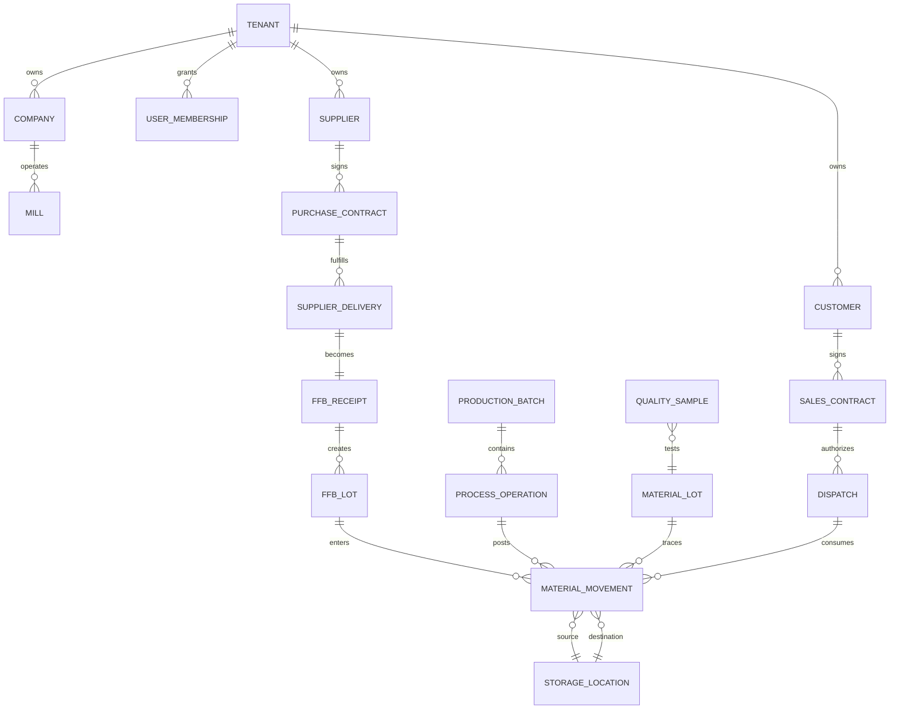
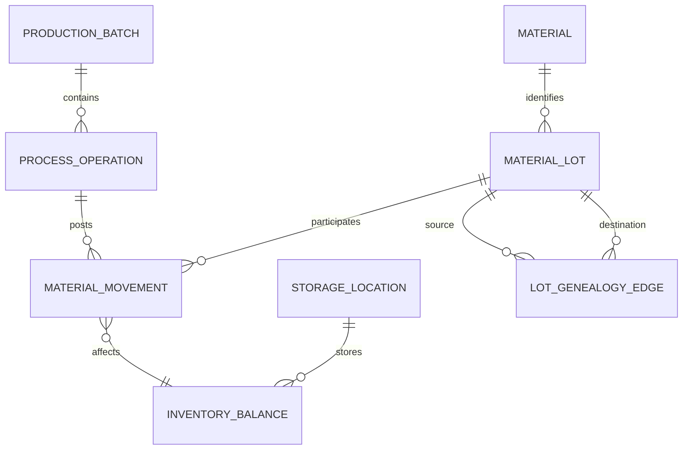

# Phase 2 — Logical Data Model

## Modeling Rules

- Internal primary keys are UUIDv7 or equivalent stable generated IDs.
- Business numbers are separate, immutable, tenant/mill-scoped strings allocated by `numbering_sequences`.
- Every tenant-owned table has `tenant_id`; mill-operational tables also have `mill_id`.
- Posted transactional records are not deleted. Masters use `active/inactive` or archive states.
- Every mutable entity has `created_at`, `created_by`, `updated_at`, `updated_by`, and `version`. Posted/critical entities also have audit references.

## High-Level Relationship Map

## Core Entity Catalog

| Entity | Owner | Purpose | Lifecycle/deletion |
|---|---|---|---|
| Tenant | Platform | SaaS security boundary | active/suspended; never hard-delete with data |
| Company | Platform | Legal/business identity | archive only |
| Mill | Platform | Operating site and timezone | archive only |
| UserMembership | Platform | User-to-tenant/mill access | revoke/disable |
| Role/Permission | Platform | Action-level authorization | version/archive permissions |
| Supplier/Customer | Master Data | Counterparties | inactive; retain history |
| Material/UOM | Master Data | Controlled material and quantity vocabularies | inactive/version conversions |
| StorageLocation/Tank/Silo | Master Data/Inventory | Physical/logical storage | unavailable/archive with history |
| ProcessDefinition/Stage/Route | Master Data/Production | Versioned configured route | immutable after use; supersede |
| Purchase/SalesContract | Commercial | Commercial commitment and quantity scope | explicit state machine |
| WeighbridgeTransaction | Weighbridge | Authoritative weighments and net | posted/reversed, never deleted |
| SupplierDelivery/FFBReceipt | Receiving | Inbound delivery transaction | explicit state machine |
| FFBLot/MaterialLot | Receiving/Inventory | Traceable quantity identity | balance/released/closed; never delete |
| FFBGrading/Result | Receiving | Acceptance/rejection data | controlled correction |
| ProductionPlan/Batch | Planning/Execution | Planned and executed production unit | explicit state machine |
| ProcessOperation | Execution | One execution of a configured stage | posted/reversed |
| MaterialMovement | Inventory | Immutable quantity movement | append/reverse only |
| InventoryBalance | Inventory | Transactional projection for availability | rebuildable from ledger |
| SamplingPlan/Sample/TestResult | Quality | Scheduled and observed quality | append/correct with audit |
| Dispatch/DispatchLine | Dispatch | Outbound material transaction | explicit state machine |
| AuditEvent | Audit | Historical action evidence | append-only |
| Document/Attachment | Documents | Metadata and secure file reference | retention/archive policy |

## Logical Schema Specification

### Platform and tenancy

| Table | Important fields | Constraints/indexes |
|---|---|---|
| tenants | id, code, name, timezone, status | unique(code); status index |
| companies | id, tenant_id, legal_name, registration_no, currency | unique(tenant_id, registration_no); tenant index |
| mills | id, tenant_id, company_id, code, name, timezone, status | unique(tenant_id, code); `(tenant_id,status)` |
| users | id, identity_subject, email, display_name, status | unique(identity_subject); unique(normalized email) |
| tenant_memberships | id, tenant_id, user_id, status | unique(tenant_id,user_id); tenant index |
| mill_access | membership_id, mill_id | unique(membership_id,mill_id) |
| roles | id, tenant_id nullable, code, name, scope | unique(scope,tenant_id,code) |
| permissions | id, code, description | unique(code) |
| role_permissions | role_id, permission_id | unique(role_id,permission_id) |
| membership_roles | membership_id, role_id | unique(membership_id,role_id) |
| numbering_sequences | id, tenant_id, mill_id, transaction_type, prefix, period, next_value | unique(tenant_id,mill_id,transaction_type,period); row lock on allocation |

### Masters

| Table | Important fields | Constraints/indexes |
|---|---|---|
| suppliers | id, tenant_id, code, name, supplier_type_id, status | unique(tenant_id,code); `(tenant_id,status)` |
| customers | id, tenant_id, code, name, status | unique(tenant_id,code) |
| materials | id, tenant_id, code, name, category, base_uom_id, status | unique(tenant_id,code) |
| uoms | id, tenant_id nullable, code, category, precision | unique(tenant_id,code) |
| uom_conversions | id, tenant_id, from_uom_id, to_uom_id, factor, effective_from | unique scoped/effective interval |
| vehicles | id, tenant_id, registration_no, transporter_id, status | unique(tenant_id,registration_no) |
| storage_locations | id, tenant_id, mill_id, code, kind, capacity, uom_id, status | unique(tenant_id,mill_id,code) |
| tanks | id, storage_location_id, tank_no, capacity, operational_status | unique(storage_location_id,tank_no) |
| production_lines | id, tenant_id, mill_id, code, capacity_per_shift, status | unique(tenant_id,mill_id,code) |
| process_definitions | id, tenant_id, code, version, status | unique(tenant_id,code,version) |
| process_stages | id, definition_id, code, sequence, stage_kind | unique(definition_id,sequence) |
| process_routes | id, definition_id, from_stage_id, to_stage_id, material_rule | route index |
| quality_parameters | id, tenant_id, code, name, unit_id, data_type, precision | unique(tenant_id,code) |
| quality_specifications | id, parameter_id, scope_type, scope_id, min_value, max_value, rule, effective_from/to | no overlapping active scope versions |
| grading_rules | id, tenant_id, code, version, configuration_json | unique(tenant_id,code,version) |

### Commercial, weighbridge, and receiving

| Table | Important fields | Constraints/indexes |
|---|---|---|
| purchase_contracts | id, tenant_id, mill_id, business_no, supplier_id, state, dates | unique(tenant_id,business_no); supplier/state index |
| purchase_contract_lines | id, contract_id, material_id, quantity, uom_id, price nullable | unique(contract_id,line_no) |
| sales_contracts | id, tenant_id, mill_id, business_no, customer_id, state, dates | unique(tenant_id,business_no) |
| sales_contract_lines | id, contract_id, material_id, quantity, uom_id, price nullable | unique(contract_id,line_no) |
| contract_fulfilments | id, contract_line_id, source_type, source_id, quantity, uom_id | unique(contract_line_id,source_type,source_id); lock line on post |
| weighbridge_transactions | id, tenant_id, mill_id, business_no, direction, vehicle_id, material_id, first_weight, second_weight, gross, tare, net, state, source_ref | unique(tenant_id,mill_id,business_no); date/status indexes |
| supplier_deliveries | id, tenant_id, mill_id, business_no, supplier_id, contract_id, weighbridge_id, state | unique(tenant_id,mill_id,business_no) |
| ffb_receipts | id, supplier_delivery_id, accepted_qty, rejected_qty, uom_id, state | unique(supplier_delivery_id); state index |
| ffb_lots | id, tenant_id, mill_id, business_no, receipt_id, quantity, status | unique(tenant_id,mill_id,business_no) |
| ffb_gradings | id, receipt_id, rule_id, grader_id, state, remarks | unique(receipt_id,version) |
| grading_results | id, grading_id, parameter_id, value, unit_id, result_status | grading index |
| rejections | id, receipt_id, quantity, reason_id, status | receipt index |

### Production, quality, inventory, and dispatch

| Table | Important fields | Constraints/indexes |
|---|---|---|
| production_plans | id, tenant_id, mill_id, plan_no, plan_date, state | unique(tenant_id,mill_id,plan_no); date/state index |
| production_batches | id, tenant_id, mill_id, batch_no, plan_id, route_version, line_id, state | unique(tenant_id,mill_id,batch_no); state/date index |
| process_operations | id, batch_id, stage_id, sequence, state, started_at, completed_at | unique(batch_id,sequence); state index |
| material_lots | id, tenant_id, mill_id, material_id, source_type, source_id, quantity, uom_id, state | source index; material/location joins |
| material_movements | id, tenant_id, mill_id, material_id, lot_id, movement_type, source_location_id, destination_location_id, quantity, uom_id, transaction_type, transaction_id, occurred_at, posted_at, reversal_of, idempotency_key | unique(tenant_id,idempotency_key); `(tenant_id,mill_id,material_id,occurred_at)`; immutable |
| inventory_balances | tenant_id, mill_id, material_id, lot_id, location_id, quantity, uom_id, version | composite PK; lock on post |
| inventory_reservations | id, balance_key, source_type, source_id, quantity, state | source unique/idempotency |
| sampling_plans | id, tenant_id, mill_id, process_point, frequency, effective dates, role | scope/effective index |
| quality_samples | id, tenant_id, mill_id, sample_no, sample_plan_id, source_type, source_id, scheduled_at, collected_at, state | unique(tenant_id,mill_id,sample_no); due/state index |
| quality_test_results | id, sample_id, parameter_id, value, unit_id, status, specification_id | unique(sample_id,parameter_id) |
| dispatches | id, tenant_id, mill_id, dispatch_no, customer_id, sales_contract_id, state, outbound_weighbridge_id | unique(tenant_id,mill_id,dispatch_no); state/date index |
| dispatch_lines | id, dispatch_id, material_id, lot_id, location_id, quantity, uom_id | dispatch index |
| documents | id, tenant_id, mill_id, document_type, entity_type, entity_id, storage_key, checksum, scan_status | entity and tenant indexes |
| audit_events | id, tenant_id, actor_id, action, entity_type, entity_id, old_values, new_values, reason, correlation_id, occurred_at | `(tenant_id,entity_type,entity_id,occurred_at)`; append-only |
| outbox_events | id, tenant_id, event_type, aggregate_type, aggregate_id, payload, status, attempts, available_at | status/available index; unique event key |

## Production Genealogy

`material_lots` and `material_movements` provide explicit lineage. A movement can consume one or more source lots and create one or more destination lots through the same transaction reference. For high-value genealogy queries, add a `lot_genealogy_edges(source_lot_id, destination_lot_id, movement_id, quantity, uom_id)` projection populated from posted movements. This is derived, not a replacement for the ledger.

## Stock Strategy

Use a ledger plus maintained balance projection. `material_movements` is authoritative and append/reversal-only. `inventory_balances` is updated in the same transaction for fast availability checks and can be rebuilt from the ledger. A reconciliation job compares balances to ledger-derived totals and alerts on drift.

## ERD — Production and Inventory

## Deletion Policy

Master records may be archived only when no future transaction may use them. Draft records may be cancelled or deleted only before external references exist. Posted weighments, receipts, gradings, operations, movements, quality results, dispatches, and audit events are never hard-deleted.
